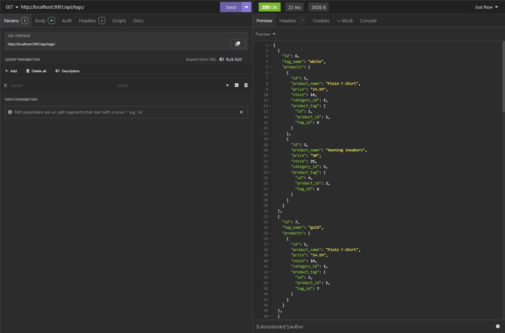
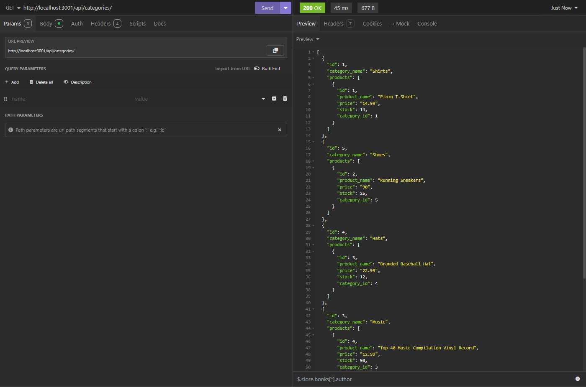
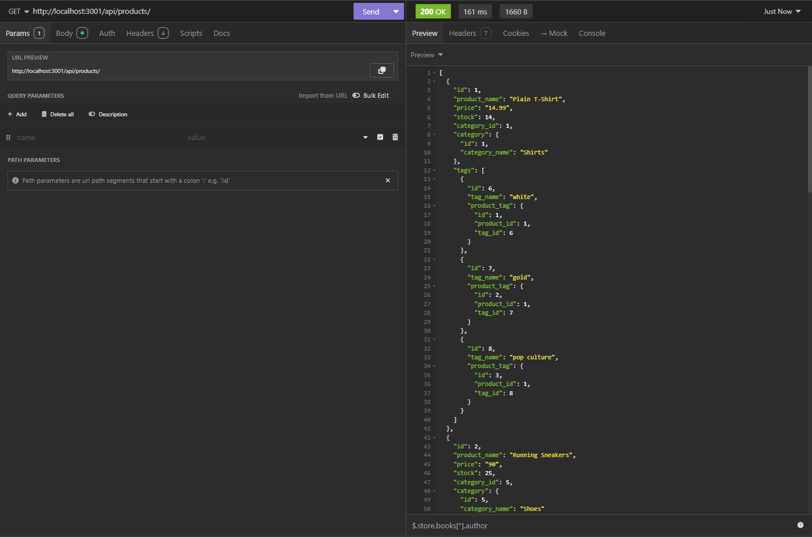

# ecommerce-backend

13-ORM/02-Challenge - e-Commerce Back End

## Description

Module 13 - Object Relational Mapping (ORM): e-Commerce Back End

Development of the back end of an e-commerce site using Sequelize to create a database with categories, products, and tags, through the execution of the following:

- model creation and data seeding for categories, products, and tags,
- get requests to view categories, products, and tags by all or by id,
- post requets to create new products, tags and categories,
- put requests to update tags and categories,
- delete requests to delete products, tags and categories

Project executed in accordance with the following challenge requirements:

### User Story

```md
AS A manager at an internet retail company
I WANT a back end for my e-commerce website that uses the latest technologies
SO THAT my company can compete with other e-commerce companies
```

### Acceptance Criteria

```md
GIVEN a functional Express.js API
WHEN I add my database name, PostgreSQL username, and PostgreSQL password to an environment variable file
THEN I am able to connect to a database using Sequelize
WHEN I enter schema and seed commands
THEN a development database is created and is seeded with test data
WHEN I enter the command to invoke the application
THEN my server is started and the Sequelize models are synced to the PostgreSQL database
WHEN I open API GET routes in Insomnia Core for categories, products, or tags
THEN the data for each of these routes is displayed in a formatted JSON
WHEN I test API POST, PUT, and DELETE routes in Insomnia Core
THEN I am able to successfully create, update, and delete data in my database
```

## Table of Contents

- [Installation](#installation)
- [Usage](#usage)
- [Credits](#credits)
- [License](#license)

## Installation

Install [NodeJS](https://nodejs.org/en) and NPM on your computer to install the required dependencies for this application.
Install [PostgreSQL](https://www.postgresql.org/download/) on your computer to create the database.
Install [Insomnia](https://insomnia.rest/) on your computer to execute the API requests.

Git and an IDE (VSCode recommended) are required to be installed on your computer to clone and view the code for this web application.

From your command line:

```md
### Clone this repository
$ git clone git@github.com:ajhearne-mZAOSW/ecommerce-backend.git

### Navigate into the repository
$ cd ecommerce-backend

### Open in IDE
$ code .
```

In the integrated terminal, navigate to the /db foler and run the following commands:

```md
### Login to postgres
psql -U postgres

### Create the database
\i schema.sql;
```

In the integrated terminal, run the following commands:

```md
### Install dependencies
npm install

### Seed the database
npm seeds/index.js

### Run the server
npm run start
```

Navigate to Insomnia and execute the API requests to navigate through the database.

## Usage

The following image shows the application's appearance and functionality:





A video showing process for using the application can be found [here.](./assets/Hearne_eCommerceBackEnd_Demo.webm)

## Credits

- Learning foudation provided by University of Sydney, USYD-VIRT-FSF-PT-05-2024-U-LOLC/13-ORM/01-Activities

## License

MIT
